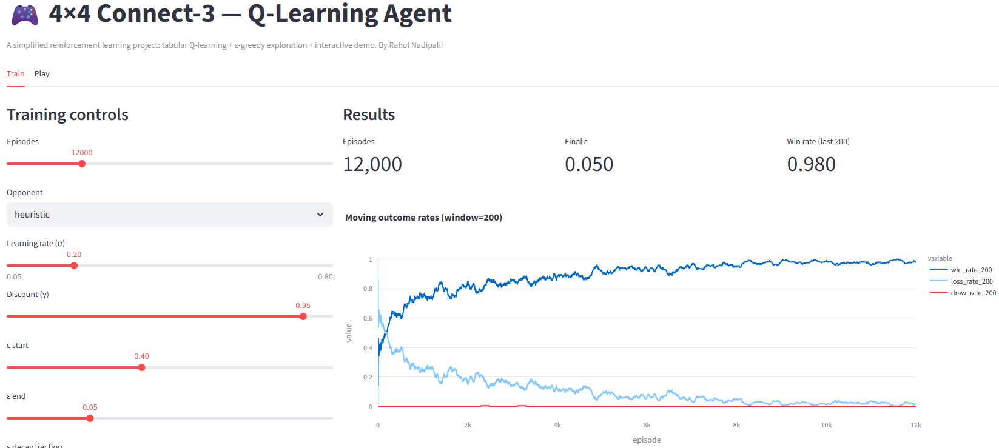
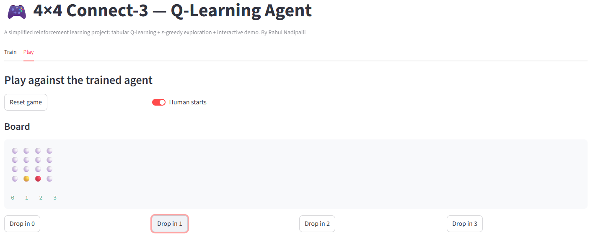

# 4×4 Connect-3 Q-Learning Agent

> An interactive reinforcement learning demo where you train a tabular Q-learning agent to play Connect-3, then challenge it yourself.


---

## Table of Contents

- [Overview](#overview)
- [Demo](#demo)
- [Features](#features)
- [Tech Stack](#tech-stack)
- [Getting Started](#getting-started)
  - [Prerequisites](#prerequisites)
  - [Installation](#installation)
  - [Running the App](#running-the-app)
- [Usage](#usage)
- [Project Structure](#project-structure)
- [Configuration](#configuration)
- [Contributing](#contributing)
- [License](#license)

---

## Overview

**4×4 Connect-3** is a browser-based reinforcement learning playground built with Streamlit. Anyone can configure, train, and play against a tabular Q-learning agent, all within a single UI.

Connect-3 is played on a **4×4 grid**. Players alternate dropping pieces into a column; pieces fall to the lowest empty row. The first player to align **3 of their pieces** horizontally, vertically, or diagonally wins. A full board with no winner is a draw.

| Symbol | Player |
|--------|--------|
| 🔴 | Agent (+1) |
| 🟡 | You (−1) |
| ⚪ | Empty |

The agent uses plain **tabular Q-learning** for training and learning how to play the game. The Q-table maps `(state, action)` pairs to float values and is updated via the Bellman equation after every step:

$$Q(s, a) \leftarrow (1 - \alpha)\,Q(s, a) + \alpha\!\left[r + \gamma \max_{a'} Q(s', a')\right]$$

Exploration follows an ε-greedy policy with linear ε decay. Two built-in opponents (**random** and **heuristic**) let you observe how training difficulty shapes the agent's strategy.

This project was built to explore classic RL concepts in a concrete, interactive setting and is intended for developers, students, or anyone curious about reinforcement learning.

## Demo



*The Train tab: configure hyperparameters on the left, view live learning curves and evaluation results on the right.*



*The Play tab: drop pieces by clicking column buttons and play against your trained agent in real time.*

> **Try it live:** [connect3.streamlit.app](https://connect3.streamlit.app/)

## Features

- Configure all Q-learning hyperparameters (α, γ, ε schedule, step penalty) via interactive sliders
- Train against a **random** or **heuristic** opponent
- View rolling win / loss / draw learning curves powered by Plotly
- Automatic greedy evaluation against both opponents after training (2,000 games each)
- Play against your trained agent in a live emoji board, choosing who moves first

## Tech Stack

| Layer | Technology |
|-------|-----------|
| UI & app framework | Streamlit |
| RL environment & agent | Pure Python + NumPy |
| Training metrics | pandas |
| Charts | Plotly |

## Getting Started

### Prerequisites

- Python 3.9+
- pip

### Installation

```bash
# 1. Clone the repository
git clone https://github.com/TheInvadr/connect3.git
cd connect3

# 2. (Recommended) Create and activate a virtual environment
python -m venv venv
# Windows
venv\Scripts\activate
# macOS / Linux
source venv/bin/activate

# 3. Install dependencies
pip install -r requirements.txt
```

### Running the App

```bash
streamlit run app.py
```

The app will open automatically in your browser at `http://localhost:8501`.

## Usage

1. Open the **Train** tab. Use the sliders and dropdowns in the left panel to set your hyperparameters and choose an opponent.
2. Click **Train**. A spinner will appear while the agent trains; metrics and learning curves render automatically when training completes.
3. Review the **learning curves** (rolling win / loss / draw rates) and the **greedy evaluation** results against both opponents.
4. Switch to the **Play** tab. Choose whether you or the agent moves first.
5. Click a column button to drop your piece (🟡). The agent (🔴) replies automatically. The board updates in real time until someone wins or the game draws.

## Project Structure

```
.
├── app.py                  # Streamlit entry point: Train & Play tabs
├── requirements.txt        # Python dependencies
├── README.md
├── connect3/
│   ├── env.py              # Connect3Env: game logic & reward shaping
│   ├── agent.py            # QLearningAgent: Q-table, ε-greedy, Bellman update
│   ├── train.py            # TrainConfig, train_q_agent(), evaluate()
│   ├── opponents.py        # random_opponent, heuristic_opponent
│   └── utils.py            # board_to_emoji() display helper
└── images/                 # Screenshots used in this README
```

## Configuration

No additional configuration is required for local use. All hyperparameters are controlled through the app's UI at runtime.

## Contributing

1. Fork the repository.
2. Create a feature branch: `git checkout -b feature/your-feature`.
3. Commit your changes: `git commit -m "Add your feature"`.
4. Push to your fork: `git push origin feature/your-feature`.
5. Open a Pull Request describing what you changed and why.

## License

This project is licensed under the [MIT License](LICENSE).

